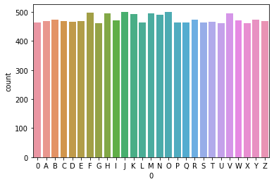
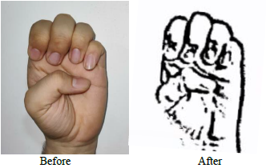
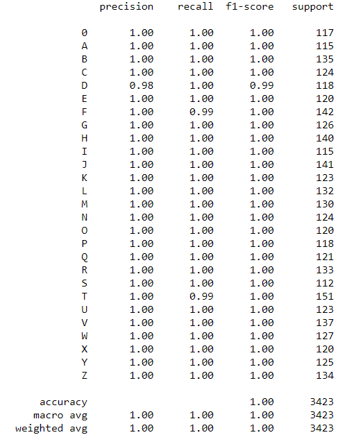
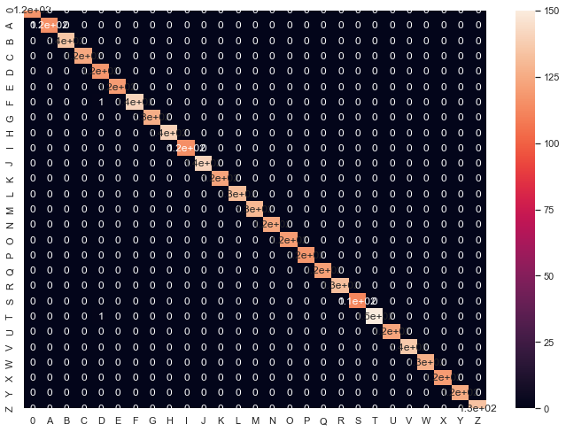

<h1 align="center">Sign Language to Speech Conversion</h1>

<div align= "center">
  <h4>Sign Language to Speech Conversion system built with OpenCV, Keras/TensorFlow using Deep Learning and Computer Vision concepts in order to communicate using American Sign Language(ASL) based gestures in real-time video streams with differently abled. </h4>
</div>


&nbsp;&nbsp;&nbsp;&nbsp;&nbsp;&nbsp;&nbsp;&nbsp;&nbsp;&nbsp;&nbsp;&nbsp;&nbsp;&nbsp;&nbsp;&nbsp;&nbsp;&nbsp;&nbsp;&nbsp;&nbsp;&nbsp;&nbsp;&nbsp;&nbsp;&nbsp;&nbsp;&nbsp;&nbsp;&nbsp;&nbsp;&nbsp;&nbsp;&nbsp;&nbsp;


</br>
## :innocent: Motivation
A language translator is extensively utilized by the mute people for converting and giving shape to their thoughts. A system is in urgent need of __recognizing and translating sign language__.  </br></br>
Lack of efficient gesture detection system designed specifically for the differently abled, motivates us as a team to do something great in this field. The proposed work aims at converting such sign gestures into speech that can be understood by normal people. The entire model pipeline is developed by CNN architecture for the classification of __26 alphabets__ and one extra alphabet for null character. The proposed work has achieved an efficiency of __99.88%__ .


<!---Unable to communicate verbally is a disability. In order to communicate there are many ways, one of the most popular methods is the use of predefined sign languages. The purpose of this project is to bridge the __research gap__ and to contribute to recognize __American sign languages(ASL)__ with maximum efficiency. This repository focuses on the recognition of ASL in real time, converting predicted characters to sentences and output is generated in terms of voice formats. The system is trained by convolutional neural networks for the classification of __26 alphabets__ and one extra alphabet for null character. The proposed work has achieved an efficiency of __99.88%__ on the test set.--->


<p align="center"></p>

## :warning: TechStack/framework used

- [OpenCV](https://opencv.org/)
- [Keras](https://keras.io/)
- [TensorFlow](https://www.tensorflow.org/)


## :file_folder: Data Distribution
The dataset used can be downloaded here - [Click to Download](https://drive.google.com/drive/folders/16ce6Hc4U5Qr6YBArcozoYom6TT5-7oSc?usp=sharing)

This dataset consists of __17113 images__ belonging to 27 classes:
*	__Training Set: 12845 images__<br />
<p align="center"></br><b>Train Data Statistics</b></p>
<!---<br /><br />--->

*	__Test Set: 4368 images__<br />
<p align="center"></br><b>Test Data Statistics</b></p>
<!---<br /><br />--->


## :star: Features
Our model is capable of predicting gestures from American sign language in real-time with high efficiency. These __predicted alphabets__ are converted to form __words__ and hence forms __sentences__. These sentences are converted into __voice modules__ by incorporating __Google Text to Speech__(gTTS API).</br></br>
The model is efficient, since we used a compact __CNN-based architecture__, it’s also computationally efficient and thus making it easier to deploy the model to embedded systems (Raspberry Pi, Google Coral, etc.). This system can therefore be used in real-time applications which aims at bridging the the gap in the process of communication between the __Deaf and Dumb people with rest of the world__.

## 🎨 Feature Extraction
* Gaussian filter is used as a pre-processing technique to make the image smooth and eliminate all the irrelevat noise.
* Intensity is analyzed and Non-Maximum suppression is implemented to remove false edges.
* For a better pre-processed image data, double thresholding is implemented to consider only the strong edges in the images.
* All the weak edges are finally removed and only the strong edges are consdered for the further phases. <br />
<br /><br />
The above figure shows pre-processed image with extracted features which is sent to the model for classification.

## 🎯 Proposed Flow
</br>
<p align="center"></p>
<!---<br />--->
The figure above shows a detailed pipeline of the model architecture. It can be interpreted that a Convolutional architecture has been proposed.


## :key: Prerequisites

All the dependencies and required libraries are included in the file <code>requirements.txt</code> [See here](./requirements.txt)

## 🚀&nbsp; Installation
1. Start and fork the repository.

2. Clone the repo
```
git clone https://github.com/pizasteve/Sign-Languge.git
```

3. Change your directory to the cloned repo and create a Python virtual environment named 'test'
```
cd Sign-Languge
python -m venv tipe
.\tipe\Scripts\activate
```

4. Now, run the following command in your Terminal/Command Prompt to install the libraries required
```
pip install -r requirements.txt
```

## :bulb: Working

1. Open terminal. Go into the cloned project directory and type the following command:
```
python live_detection.py
```

2. To train the model, open the [ASL_train](https://github.com/pizasteve/Sign-To-Speech-Conversion/blob/master/ASL_train.ipynb) file in jupyter notebook and run all the cells </br>

3. To detect ASL Gestures in real-time video streams run the [ASL_Real-Time.ipynb](https://github.com/pizasteve/Automated-Sign-To-Speech-Conversion/blob/master/ASL_Real-Time.ipynb) file.

* __'NOTE'__: You can directly use [asl_classifier.h5](https://github.com/pizasteve/Automated-Sign-To-Speech-Conversion/blob/master/asl_classifier.h5) file trained by me for real-time predictions in [Real-Time](https://github.com/pizasteve/Automated-Sign-To-Speech-Conversion/blob/master/ASL_Real-Time.ipynb) file.

</br></br>
## :key: Results 
#### Our model gave 99.8% accuracy for Sign Language Detection after training via <code>tensorflow-gpu==2.0.0</code>
<br /><br /><br />
* The model has been trained on a python based environment on Jupyter platform.
* The model is iterated for a total epoch of 20. 
* The model has attained an accuracy of __99.88 %__ accuracy on the Validation set.
* The prescribed model has been evaluated on __Test set__ where it has attained an accuracy of __99.85%__ with loss of 0.60 %.
#### We got the following accuracy/loss training curve plot
<br />
#### The above figure shows the Loss plot of the model throughout it's training journey. 

<br /><br /><br/>
#### The above figure shows the Accuracy plot of the model throughout it's training journey. 

## 📈 Analysis

#### The training phase data has been evaluated on the Heatmap Plotting representation. 
<br />
#### The prescribed analysis aims that each class is most correlated with that traned class.

